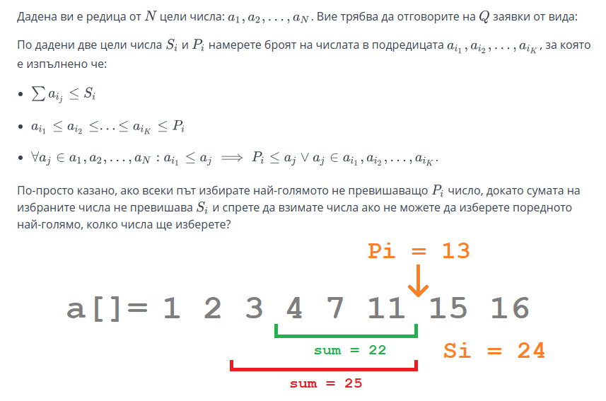

# Weird queries

#### [my_solution](solutions/WeirdQueries.cpp)

Input Format

Първият ред на стандартният вход се съдържа две числа  и  - броят на елементите в редицата и броят заявки.

Следващият ред съдържа  на брой цели числа  - елментите на редицата.

Следващите  на брой реда съдържат по две цяли числа  и  - числата от заявката.

Constraints

Output Format

Изведете  на брой реда с по едно число - отговора на поредната заявка.

Sample Input 0

7 5
70 10 130 50 40 20 40
150 100
140 50
190 130
60 80
300 60
Sample Output 0

2
3
1
0
5